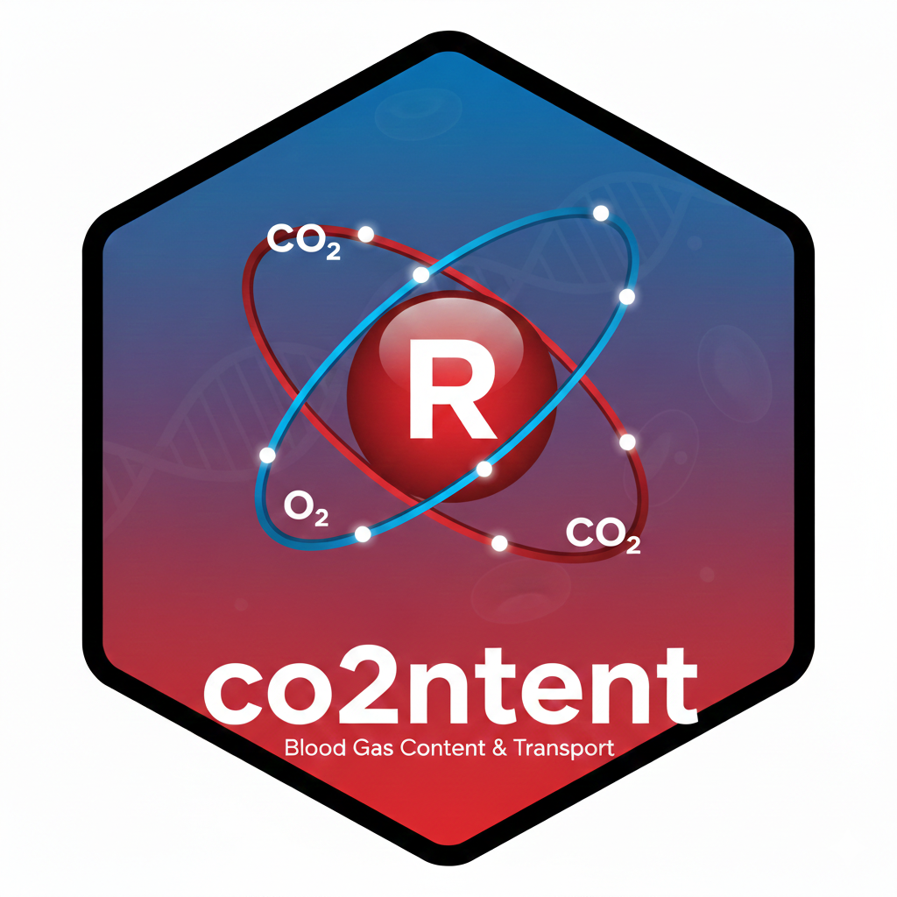
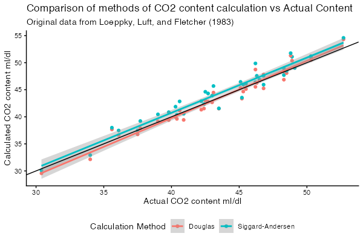

# co2ntent 

An R package for calculating carbon dioxide and oxygen content of blood.

The co2ntent package provides several canonical formulae from the
literature, for the calculation of carbon dioxide and oxygen content
of the blood.

Some data sets presented in the referenced literature are also included.

Several helper methods for units conversion are also provided.

Installing the development version
-------

You can use the [devtools](https://github.com/hadley/devtools/wiki) package by [Hadley Wickham](http://had.co.nz/) to automate the process (make sure you follow [the full instructions to get started](http://www.rstudio.com/projects/devtools/)):

``` r
if (! requireNamespace("devtools")) install.packages("devtools")
devtools::install_github("bakenzua/co2ntent")
```

Example
-------

This is an example demonstrating how `con2tent` can be used with tidyverse functions on the inbuilt dataset.

``` r
library(dplyr)
library(tidyr)
library(ggplot2)
library(co2ntent)

# Table 3 data from Douglas et al 1988
names(co2ntent::douglas_table_3)
# [1] "subject"                  "sample_type"              "ph"
# [4] "haemoglobin_g_dl"         "so2_fraction"             "blood_co2_content_ml_dl"
# [7] "pco2_torr"                "plasma_co2_content_ml_dl"

co2ntent::douglas_table_3 |>
  mutate(
    # calculate douglas blood content
    douglas_calculated_content_blood_ml_dl = co2_content(
      pco2 = pco2_torr,
      ph = ph,
      haemoglobin_g_dl = haemoglobin_g_dl,
      so2_fraction = so2_fraction,
      phase = "blood",
      method = "douglas",
      content_units = "ml/dL",
      pressure_units = "mmHg"
    ),
    siggaard_calculated_content_blood_ml_dl = co2_content(
      # calculate hco3
      hco3_mmols_l = purrr::map2_dbl(
        pco2_torr,
        ph,
        actual_bicarbonate_content_mmol_l,
        pressure_units = "mmHg"
      ),
      pco2 = pco2_torr,
      haemoglobin_g_dl = haemoglobin_g_dl,
      so2_fraction = so2_fraction,
      ph = ph,
      phase = "blood",
      method = "siggaard_andersen",
      content_units = "ml/dL",
      pressure_units = "mmHg"
    )
  ) |>
  select(
    blood_co2_content_ml_dl,
    douglas_calculated_content_blood_ml_dl,
    siggaard_calculated_content_blood_ml_dl
  ) |>
  pivot_longer(
    c(
      douglas_calculated_content_blood_ml_dl,
      siggaard_calculated_content_blood_ml_dl
    ),
    names_to = "calculated_method",
    values_to = "calculated_content"
  ) |>
  mutate(
    calculated_method = if_else(
      calculated_method == "douglas_calculated_content_blood_ml_dl",
      "Douglas",
      "Siggard-Andersen"
    )
  ) |> 
  ggplot(aes(
    blood_co2_content_ml_dl,
    calculated_content,
    colour = calculated_method
  )) +
  geom_point() +
  geom_smooth(method = 'lm') +
  geom_abline(slope = 1, intercept = 0) +
  theme_classic() +
  labs(
    title = "Comparison of methods of CO2 content calculation vs Actual Content",
    subtitle = "Original data from Loeppky, Luft, and Fletcher (1983)",
    x = "Actual CO2 content ml/dl",
    y = "Calculated CO2 content ml/dl",
    colour = "Calculation Method"
  ) +
  theme(
    legend.position = "bottom"
  )

```
