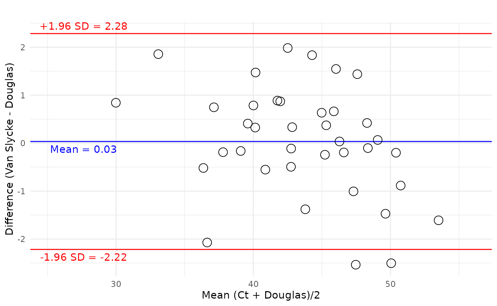
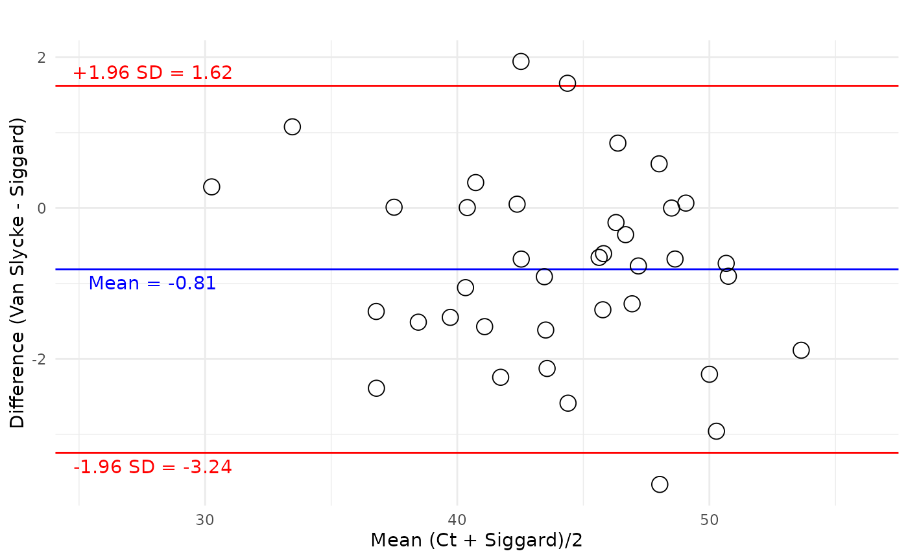
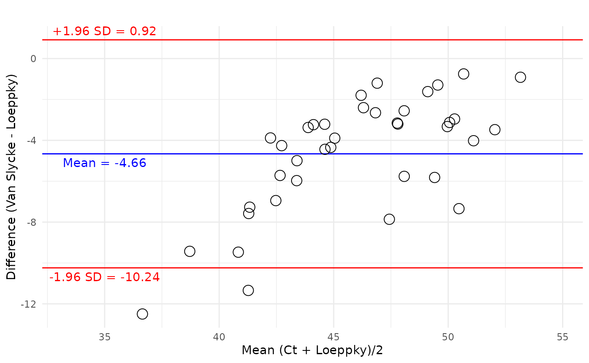

# Calculating CO2 Content of Blood

## Introduction

Several canonical methods of calculating the CO₂ content in blood are
described. `co2ntent` currently implements three methods:

- Douglas et al. (1988)
- Siggaard-Andersen et al. (1988)
- Loeppky et al. (1983)

Using the data from Table 3 from Douglas et al. (1988), this vignette
will demonstrate the calculation of the CO₂ content of whole blood
($`Ct_{CO_2}`$)and compare each method to measured values of
$`Ct_{CO_2}`$. Measurements wre performed using the Van Slyke method of
determining total CO₂ content ($`Ct_{CO_2.VS}`$) by vacuum extraction;
releasing gases from a blood sample using acid, followed by manometric
measurement.

``` r


# Calculate CO2 content via the three canonical methods
df <- co2ntent::douglas_table_3 |> 
  mutate(
    douglas_co2_blood_ct_ml_dl = co2_content(
      pco2 = pco2_torr,
      ph = ph,
      haemoglobin_g_dl = haemoglobin_g_dl,
      so2_fraction = so2_fraction,
      phase = "blood",
      method = "douglas",
      content_units = "ml/dL",
      pressure_units = "mmHg"
    ),
    siggaard_co2_blood_ct_ml_dl = co2_content(
      # calculate hco3
      hco3_mmols_l = purrr::map2_dbl(
        pco2_torr,
        ph,
        actual_bicarbonate_content_mmol_l,
        pco2_units = "mmHg"
      ),
      pco2 = pco2_torr,
      haemoglobin_g_dl = haemoglobin_g_dl,
      so2_fraction = so2_fraction,
      ph = ph,
      phase = "blood",
      method = "siggaard_andersen",
      content_units = "ml/dL",
      pressure_units = "mmHg"
    ),
    loeppky_co2_blood_ct_ml_dl = co2_content(
      pco2 = pco2_torr,
      phase = "blood",
      method = "loeppky",
      content_units = "ml/dL",
      pressure_units = "mmHg"
    )
  )
```

## Methods and theoretical background

## Douglas method

The content of CO₂ in blood calculated via the method developed by
Douglas et al. (1988) is termed $`Ct_{CO_2.Douglas}`$

``` r

bland_altman_plot(
  data=df, 
  var_a=blood_co2_content_ml_dl, 
  var_b=douglas_co2_blood_ct_ml_dl,
  xlab = "Mean (Ct + Douglas)/2",
  ylab = "Difference (Van Slycke - Douglas)",
  plot_title = ""
  ) +
  theme_minimal()
```



## Siggard-Andersen method

The content of CO₂ in blood calculated via the method developed by
Siggaard-Andersen et al. (1988) is termed $`Ct_{CO_2.Siggard}`$

``` r

bland_altman_plot(
  data=df, 
  var_a=blood_co2_content_ml_dl, 
  var_b=siggaard_co2_blood_ct_ml_dl,
  xlab = "Mean (Ct + Siggard)/2",
  ylab = "Difference (Van Slycke - Siggard)",
  plot_title = ""
  ) +
  theme_minimal()
```



## Loeppky method

The content of CO₂ in blood calculated via the method developed by
Loeppky et al. (1983) is termed $`Ct_{CO_2.Loeppky}`$

``` r

bland_altman_plot(
  data=df, 
  var_a=blood_co2_content_ml_dl, 
  var_b=loeppky_co2_blood_ct_ml_dl,
  xlab = "Mean (Ct + Loeppky)/2",
  ylab = "Difference (Van Slycke - Loeppky)",
  plot_title = ""
  ) +
  theme_minimal()
```



### References

Douglas, A. R., N. L. Jones, and J. W. Reed. 1988. “Calculation of whole
blood CO2 content.” *J. Appl. Physiol.* 65 (1): 473–77.

Loeppky, J. A., U. C. Luft, and E. R. Fletcher. 1983. “Quantitative
description of whole blood CO2 dissociation curve and Haldane effect.”
*Respir Physiol* 51 (2): 167–81.

Siggaard-Andersen, O., P. D. Wimberley, N. Fogh-Andersen, and I. H
Gøthgen. 1988. “Measured and Derived Quantities with Modern pH and Blood
Gas Equipment: Calculation Algorithms with 54 Equations.” *Scandinavian
Journal of Clinical and Laboratory Investigation* 48 (sup189): 7–15.
<https://doi.org/10.1080/00365518809168181>.
